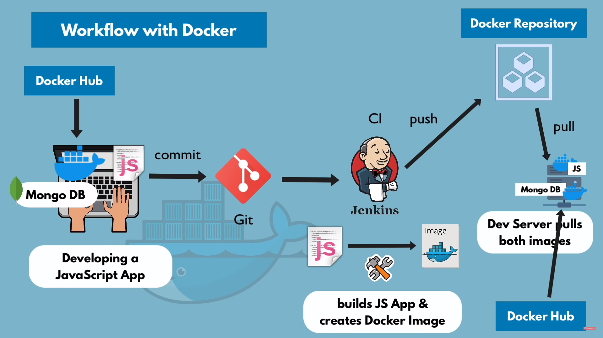

# Basic Command

- installing docker images

        docker pull node
        docker pull redis

- seeing list of running conainers and images list

        docker images
        docker run redis
        docker ps
        docker run -d redis
        docker stop <container ID>
        docker ps -a
        docker restart < ID>

- running redis on particular port

        docker run -p6000:6379 redis   -- computer port6000, docker port 6379
        docker run -p6001:6379 redis

        docker run -d -p6000:6379 --name redis-older redis:4.0
        docker run -d -p6001:6379 --name redis-latest redis

- for getting inside a container

        docker exec -it <container ID> /bin/bash

        write : ls, cd /, env, exit

- if you can not stop the container..

        sudo aa-remove-unknown
        docker stop <container ID>

# Docker Project

- This foto is taken from Docker Tutorial for Beginners, owner : "TechWorld with Nana".

# Installing docker on Linux

      sudo apt-get remove docker docker-engine docker.io containerd runc

      sudo apt-get update

      sudo apt-get install     ca-certificates     curl     gnupg     lsb-release

      sudo mkdir -p /etc/apt/keyrings

      curl -fsSL https://download.docker.com/linux/ubuntu/gpg | sudo gpg --dearmor -o /etc/apt/keyrings/docker.gpg

      echo   "deb [arch=$(dpkg --print-architecture) signed-by=/etc/apt/keyrings/docker.gpg] https://download.docker.com/linux/ubuntu \ $(lsb_release -cs) stable" | sudo tee /etc/apt/sources.list.d/docker.list > /dev/null

      sudo chmod a+r /etc/apt/keyrings/docker.gpg

      sudo chmod a+r /etc/apt/keyrings/docker.gpg

      sudo apt-get install docker-ce docker-ce-cli containerd.io docker-compose-plugin

- for testing installation, write :

        sudo docker run hello-world

- for solving "got permision denied" error

        sudo chmod 666 /var/run/docker.sock

        sudo usermod -aG docker user

- [for more information](https://docs.docker.com/engine/install/ubuntu/)
